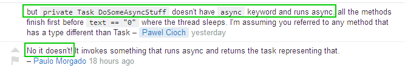
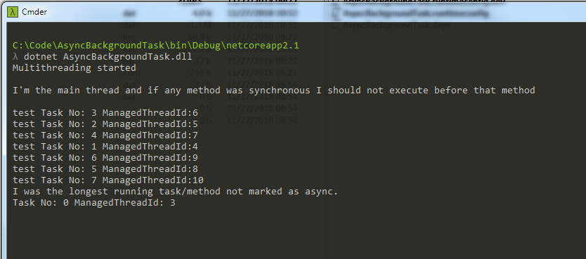

# Answer proof #

[https://stackoverflow.com/questions/53464752/task-vs-async-task-when-running-multiple-task-in-background](https://stackoverflow.com/questions/53464752/task-vs-async-task-when-running-multiple-task-in-background "https://stackoverflow.com/questions/53464752/task-vs-async-task-when-running-multiple-task-in-background")

Disclaimer: Debate may be missing context ie. different point of interpretation to same subject, so my assumption is marked green

Re:

Proof (see the source code to have better reference):

